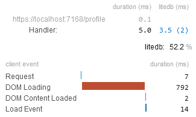
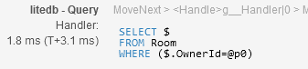

# MiniProfiler.LiteDB

A simple wrapper for profiling LiteDB database with MiniProfiler.

## How it works

This package implements `ProfiledLiteEngine` wrapper for `LiteEngine` class.
The wrapper measures [custom timings](https://miniprofiler.com/dotnet/HowTo/ProfileCode)
in all methods that query or modify data in LiteDB database.

The results look like this

|  |  |
|--------------------------------------------|------------------------------------------|

## How to use

You can simply substitute `new LiteDatabase()` constructor calls with `ProfiledLiteDatabaseFactory.New()` calls.
This factory method has matching overloads, with the exception of mandatory `profiler` parameter.

Under the hood, this method creates `LiteDatabase` instance with profiled engine instance.

```csharp
var database = ProfiledLiteDatabaseFactory.New(ConnectionString, MiniProfiler.Current);
```

Alternatively, create `ProfiledLiteEngine` and pass it to `LiteDatabase` manually.

```csharp
var database = new LiteDatabase(
    new ProfiledLiteEngine(new SharedEngine(settings), MiniProfiler.Current)
);
```

## License

This packages is distributed under the [MIT License](LICENSE.md)

---

[LiteDB](https://github.com/mbdavid/LiteDB) is licensed under the [MIT license](https://github.com/mbdavid/LiteDB/blob/master/LICENSE). Credits: [Mauricio David](https://github.com/mbdavid)

[MiniProfiler](https://github.com/MiniProfiler/dotnet) is licensed under the [MIT license](https://github.com/MiniProfiler/dotnet/blob/main/LICENSE.txt). Credits: .NET MiniProfiler Contributors
